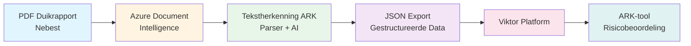
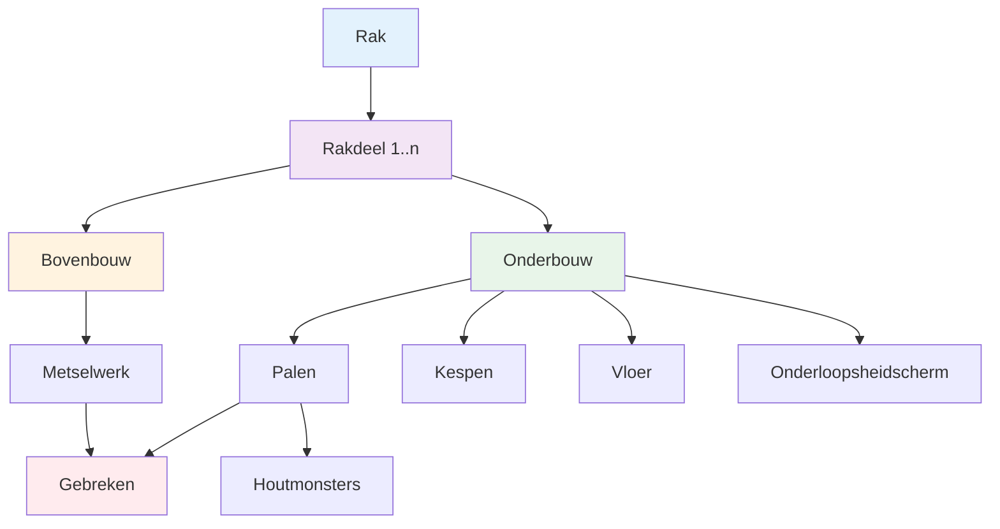

# Tekstherkenning ARK

## Projectbeschrijving en Doelstelling

Deze tool ondersteunt het **ARK-proces** (Amsterdamse Risicobeoordeling Kademuren) van de Gemeente Amsterdam door duikinspecties automatisch te transformeren naar gestructureerde data. 

### Wat doet de tool?
Duikinspectierapporten (PDF-formaat van Nebest) worden:
1. Ingelezen met **Azure Document Intelligence** voor tekstherkenning
2. Geanalyseerd met **AI-gebaseerde classificatie** voor gebrekdetectie
3. Omgezet naar een gevalideerde datastructuur (Pydantic models)
4. Geëxporteerd naar **JSON** of **Excel**
5. Klaargezet voor integratie met [Viktor](https://www.viktor.ai/) en de [ARK-tool](https://github.com/ic144/ark-automatiseren)

### Voordelen
- ✅ Automatiseert handmatig invoerwerk van duikinspectiegegevens
- ✅ Vermindert fouten door gevalideerde datastructuren
- ✅ Bespaart tijd en verhoogt consistentie
- ✅ Maakt gegevens machineleesbaar voor verdere analyse

---

## Installatie

### 1. UV Installeren
Deze project gebruikt [UV](https://github.com/astral-sh/uv) als package manager. Installeer UV via de [docs](https://docs.astral.sh/uv/getting-started/installation/)

### 2. Project Installatie
```bash
# Clone de repository
git clone <repository-url>
cd tekstherkenning-ark

# Installeer dependencies met UV
uv sync

# Maak een .env bestand aan met Azure credentials
cp .env.example .env
# Vul je Azure Document Intelligence en OpenAI credentials in
```

### 3. Benodigde Environment Variabelen (.env)
```env
# Azure Document Intelligence
AZURE_DOCUMENT_INTELLIGENCE_ENDPOINT=https://your-resource.cognitiveservices.azure.com/
AZURE_DOCUMENT_INTELLIGENCE_KEY=your-key-here

# Azure OpenAI (voor LLM-gebaseerde gebrekdetectie)
AZURE_OPENAI_ENDPOINT=https://your-openai.openai.azure.com/
AZURE_OPENAI_API_KEY=your-api-key
AZURE_OPENAI_DEPLOYMENT_NAME=gpt-4o
AZURE_OPENAI_API_VERSION=2024-08-01-preview
```

### Command-line interface

De tool kan worden gebruikt via de command-line om duikinspectierapporten te verwerken:

```bash
uv run tekstherkenning-ark -i <input_pdf_path> [-o <output_directory>]
```

**Parameters:**
- `-i`, `--input`: Pad naar het input PDF bestand (verplicht)
- `-o`, `--output`: Output directory voor het JSON bestand (optioneel, default: huidige directory)
- `--no-cache`: Gebruik geen cache voor Azure Document Intelligence (optioneel)

**Voorbeelden:**

```bash
# Verwerk een rapport en sla op in huidige directory
uv run tekstherkenning-ark -i data/duikrapporten/HEG0201_Houtmonstername.pdf

# Verwerk een rapport en sla op in specifieke directory
uv run tekstherkenning-ark -i data/duikrapporten/HEG0201_Houtmonstername.pdf -o data/json_exports

# Verwerk zonder cache te gebruiken
uv run tekstherkenning-ark -i data/duikrapporten/HEG0201_Houtmonstername.pdf -o output --no-cache
```

De output wordt automatisch opgeslagen met een bestandsnaam gebaseerd op de rakcode (bijv. `HEG0201`) en een timestamp in het formaat: `{rakcode}_{YYMMDD_HHMM}.json`

**Belangrijke punten:**
- Het PDF bestand moet een geldige rakcode bevatten (bijv. HEG0201, AMS0601)
- PDF's met "boorweestand" in de bestandsnaam worden automatisch afgewezen, aangezien dit type rapport niet wordt ondersteund
- De output directory wordt automatisch aangemaakt als deze nog niet bestaat

## Repository Structuur

```
tekstherkenning-ark/
├── src/tekstherkenning_ark/       # Hoofdbroncode
│   ├── models/                     # Pydantic datamodellen (Rak, Rakdeel, Paal, etc.)
│   ├── llm/                        # LLM-gebaseerde classificatie en detectie
│   ├── document/                   # Document parsing logica
│   ├── enums.py                    # Enumeraties voor gestandaardiseerde waarden
│   ├── utils.py                    # Hulpfuncties
│   ├── logger.py                   # Logging configuratie
│   └── constants.py                # Project constanten
├── tests/                          # Unit tests (pytest)
│   ├── test_*.py                   # Test bestanden per component
│   ├── conftest.py                 # Pytest fixtures en configuratie
│   ├── data/                       # Test data
│   └── scripts/                    # Test scripts
├── scripts/                        # Utility scripts voor data processing
├── docs/                           # Documentatie
│   ├── datamodel.mermaid           # Datamodel visualisatie
│   ├── llm-gebrektype-detectie.md  # LLM detectie documentatie
│   ├── uitleg_velden_ark.md        # ARK velden mapping
│   └── gebruik_doc_intelligence.md # Document Intelligence gebruik
├── data/                           # Data directory (niet in git)
│   ├── duikrapporten/              # Input PDF rapporten
│   ├── json_exports/               # Geëxporteerde JSON bestanden
│   ├── excel_exports/              # Geëxporteerde Excel bestanden
│   └── logs/                       # Processing logs
├── main.py                         # Hoofd entry point
├── pyproject.toml                  # Project configuratie en dependencies
└── README.md                       # Deze documentatie
```

### Test Structuur
Tests zijn georganiseerd per component met:
- **Unit tests** voor individuele modellen (`test_paal.py`, `test_rakdeel.py`, etc.)
- **Integration tests** voor volledige parsing (`test_rak_base_model_integration.py`)
- **Fixtures** in `conftest.py` voor herbruikbare test data
- **Test data** in `tests/data/` voor realistische testscenario's

---

## Integratie Stroomschema



### Proces Flow Details
1. **Input**: PDF duikinspectierapporten van Nebest
2. **OCR/Extractie**: Azure Document Intelligence leest tabellen, paragrafen en tekst
3. **Parsing & AI**: 
   - Structuur wordt herkend en gevalideerd
   - LLM classificeert gebrektypes intelligent
   - Data wordt omgezet naar Pydantic models
4. **Export**: JSON/Excel output met gevalideerde data
5. **Viktor Integratie**: Gestructureerde data wordt ingelezen in Viktor
6. **ARK-tool**: Finale risicobeoordeling en rapportage

---

## Datamodel Structuur

Het datamodel is hiërarchisch opgebouwd volgens de structuur van kademuren:



### Kerncomponenten

| Component | Beschrijving | Belangrijke velden |
|-----------|--------------|-------------------|
| **Rak** | Volledige kademuur | raknaam, rakdelen, totale_lengte_m |
| **Rakdeel** | Sectie van de kademuur | rakdeel_id, bovenbouw, onderbouw, constructietype |
| **Bovenbouw** | Bovengrondse structuur | metselwerk, materiaal, scheuren, buik |
| **Onderbouw** | Ondergrondse fundering | palen, kespen, vloer, onderloopsheidscherm |
| **Paal** | Fundatiepaal | paal_nummer, diameter, materiaal, gebreken, houtmonsters |
| **Gebrek** | Schade/afwijking | codering, omschrijving, type (Scheur, GrondVoerendGat, etc.) |
| **Houtmonster** | Monster voor datering | houtmonster_code, is_aangetast, stichtingjaar |

### Gebrektypen (met AI-classificatie)
- **Scheur** (+ subtypen: ScheurHout, ScheurMetselwerk)
- **GrondVoerendGat** - Gat met grondstroming
- **LokaalVerdwenenMetselwerk** - Ontbrekend metselwerk zonder grondvoering
- **BuikInWand** - Uitbuiging/convexe vervorming
- **Scheefstand** - Afwijking van verticale stand
- **OnderloopsheidschermBeschadigd** - Schade aan onderloopsheidscherm

Zie [docs/datamodel.mermaid](docs/datamodel.mermaid) voor het volledige UML class diagram.

---

## AI en Azure Resources

### Azure Document Intelligence
**Doel:** Optical Character Recognition (OCR) en layout analyse van PDF-documenten.

**Gebruik:**
- Extractie van tabellen, paragrafen en tekst uit duikinspectierapporten
- Layout herkenning voor structuuranalyse
- Multi-page document processing

**Setup:**
1. Maak een Azure Document Intelligence resource aan in Azure Portal
2. Verkrijg endpoint en API key
3. Configureer in `.env` bestand

**Resources:**
- [Azure Document Intelligence Docs](https://learn.microsoft.com/en-us/azure/ai-services/document-intelligence/)
- [Python SDK](https://pypi.org/project/azure-ai-documentintelligence/)

### Azure OpenAI (LLM-gebaseerde Gebrekdetectie)
**Doel:** Intelligente classificatie van gebrektypen met contextbegrip.

**Waarom LLM?**
Traditionele keyword-matching faalt bij:
- **GrondVoerendGat vs LokaalVerdwenenMetselwerk**: Verschil tussen grondvoerende en niet-grondvoerende gaten vereist contextbegrip
- **BuikInWand vs Scheefstand**: Onderscheid tussen uitbuiging en afwijking van verticaal

**Implementatie:**
- Azure OpenAI GPT-4o voor tekstanalyse
- Structured output (JSON mode) voor betrouwbare classificatie
- Caching van LLM-resultaten voor performance
- Gedetailleerde prompt engineering met type-specifieke instructies

**Setup:**
1. Maak een Azure OpenAI resource aan
2. Deploy GPT-4o model
3. Configureer credentials in `.env`

**Resources:**
- [Azure OpenAI Docs](https://learn.microsoft.com/en-us/azure/ai-services/openai/)
- [LLM Gebrekdetectie Details](docs/llm-gebrektype-detectie.md)

### Caching en Performance
- Document Intelligence resultaten worden gecached in `data/logs/`
- LLM classificaties worden gecached om kosten te reduceren
- Cache management scripts: `clear_llm_cache.py`, `delete_llm_cache.py`

---

## Gebruikte Packages

### Kernbibliothekenpackages
| Package | Versie | Gebruik |
|---------|--------|---------|
| **pydantic** | ≥2.12.5 | Datavalidatie en type-safe models |
| **azure-ai-documentintelligence** | ≥1.0.0 | OCR en document parsing |
| **openai** | ≥2.15.0 | Azure OpenAI integratie voor LLM |
| **tiktoken** | ≥0.12.0 | Token counting voor LLM calls |
| **python-dotenv** | ≥1.0.0 | Environment variabelen management |

### Data Processing
| Package | Versie | Gebruik |
|---------|--------|---------|
| **pandas** | ≥3.0.0 | Data manipulatie en CSV/Excel export |
| **openpyxl** | ≥3.1.5 | Excel bestand lezen en schrijven |
| **unidecode** | ≥1.4.0 | Unicode normalisatie voor tekstverwerking |

### Development & Testing
| Package | Versie | Gebruik |
|---------|--------|---------|
| **pytest** | ≥9.0.2 | Unit testing framework |
| **polyfactory** | ≥3.3.0 | Test data factories voor Pydantic models |
| **black** | - | Code formatting (119 char line length) |
| **isort** | - | Import sorting |

### Waarom deze keuzes?
- **Pydantic**: Type-veiligheid en automatische validatie voorkomt data-inconsistenties
- **Azure Services**: Enterprise-grade betrouwbaarheid en GDPR-compliant
- **UV**: Snellere dependency resolution en betere reproduceerbare builds
- **Pytest**: Industry standard voor Python testing met uitgebreide fixture support

---

## Samenwerken

### Branching Strategie
- **main** - Stabiele releases (production-ready)
- **develop** - Development branch voor nieuwe features
- **feature/** - Feature branches (gebruik `kebab-case`, bijv. `feature/nieuwe-parser`)

### Workflow
1. Maak een feature branch vanaf `develop`
2. Ontwikkel en test je feature (`uv run pytest`)
3. Zorg voor code formatting (`black`, `isort`)
4. Maak een pull request naar `develop`
5. Na review en goedkeuring: merge naar `develop`
6. Releases worden gedaan van `develop` naar `main`

### Code Standaarden
- ✅ Voertaal: **Nederlands** (documentatie, comments, variabelen)
- ✅ Python compatibiliteit: **≥3.13**
- ✅ Code style: **Black** + **isort** (max line length: 119)
- ✅ Type hints: Gebruik type hints voor alle functies
- ✅ Docstrings: NumPy-style docstrings voor functies en classes
- ✅ Testing: Minimaal gerichte pytest-tests voor wijzigingen
- ✅ Gebruik **UV** voor alle Python commando's (niet pip/python direct)

### Testing Guidelines
- Schrijf unit tests voor nieuwe features en bugfixes
- Gebruik descriptieve namen in Nederlands
- Houd tests simpel en gefocust op één aspect
- Vermijd echte Azure/OpenAI calls; gebruik mocks of gecachte data
- Run tests met: `uv run pytest`

---

## Documentatie

Zie de [docs/](docs/) folder voor gedetailleerde documentatie:
- [datamodel.mermaid](docs/datamodel.mermaid) - Volledig UML class diagram
- [llm-gebrektype-detectie.md](docs/llm-gebrektype-detectie.md) - LLM classificatie details
- [uitleg_velden_ark.md](docs/uitleg_velden_ark.md) - Mapping duikrapporten naar ARK-velden
- [gebruik_doc_intelligence.md](docs/gebruik_doc_intelligence.md) - Document Intelligence usage
- [testing.md](docs/testing.md) - Testing strategieën
- [logging.md](docs/logging.md) - Logging configuratie

---

## Contact

### Development Team
- **Sammie Knoppert** - [sammie.knoppert@arcadis.com](mailto:sammie.knoppert@arcadis.com)
- **Matthias Tavasszy** - [matthias.tavasszy@witteveenbos.com](mailto:matthias.tavasszy@witteveenbos.com)

### Opdrachtgever
- **Gemeente Amsterdam** - ARK-proces Kademuren

### Support
Voor vragen over:
- 🐛 **Bugs/Issues**: Maak een GitHub issue aan
- 💡 **Feature requests**: Maak een GitHub issue met label `enhancement`
- 📖 **Documentatie**: Zie de [docs/](docs/) folder
- 🔧 **Development**: Neem contact op met het development team

---

## Licentie
Zie [LICENSE](LICENSE) voor details.

---

**Laatste update:** 11 maart 2026

